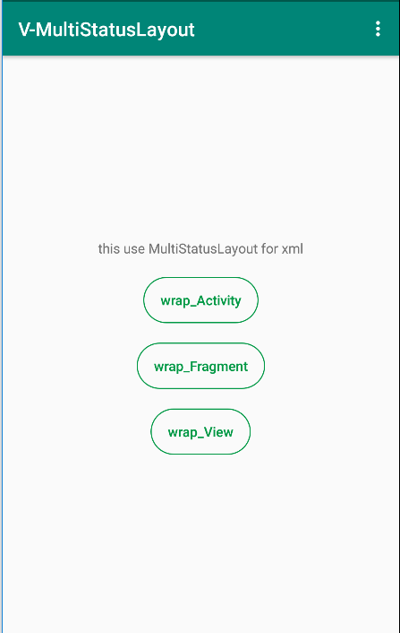

<p align="center">
   <a href="https://bintray.com/vension/maven/MultiStatusLayout/_latestVersion">
    
  </a>
  <a href="https://travis-ci.org/Vension/V-MultiStatusLayout">
    
  </a>
  <a href="https://developer.android.com/about/versions/android-4.0.html">
    
  </a>
  <a href="http://www.apache.org/licenses/LICENSE-2.0">
    
  </a>
  <a href="https://www.jianshu.com/u/38adb0e04e65">
    
  </a>
</p>

# V-MultiStatusLayout
### Support AndroidX  Kotlin
A MultiStatusLayout for Android PageStatus -- use freely configurable（多状态Layout -- 可自由配置）


## Preview
<p>
    
</p>
<div>
    
    
    
    
    
    
</div>

## Download [  ](https://bintray.com/vension/maven/MultiStatusLayout/_latestVersion)
``` gradle
 implementation 'com.vension:MultiStatusLayout:_latestVersion'
```

## Usage

* **具体使用查看demo示例**
```java
val msl_WrapActivity = MultiStatusLayout(this).wrap(this)
msl_WrapActivity.setTextColor(android.R.color.holo_red_dark)
                .setTextSize(40)
                .setErrorImage(R.drawable.img_change_error)
                .setErrorText("我是自定义的错误数据提示")
                .setRetryTextColor(R.color.colorAccent)
                .setRetryBackground(R.drawable.shape_custom_retry)
                .showError()
```

## update
* **V1.0.0**: <初始化版本>


## License
```
 Copyright 2018, Vension

   Licensed under the Apache License, Version 2.0 (the "License");
   you may not use this file except in compliance with the License.
   You may obtain a copy of the License at

       http://www.apache.org/licenses/LICENSE-2.0

   Unless required by applicable law or agreed to in writing, software
   distributed under the License is distributed on an "AS IS" BASIS,
   WITHOUT WARRANTIES OR CONDITIONS OF ANY KIND, either express or implied.
   See the License for the specific language governing permissions and
   limitations under the License.
```

